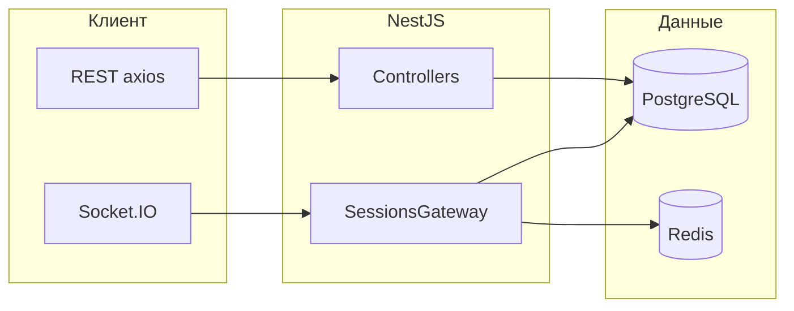

# Платформа учебных игр (EduPlay)

Веб-приложение для создания игр по шаблонам, проведения игровых сессий в классе и обмена играми через общую библиотеку. Поддерживаются регистрация и вход, публикация игр, приглашение участников по коду сессии (для викторины), обновление состояния в реальном времени через WebSocket.

Краткая схема модулей и путей в репозитории приведена в файле [arcitecture.txt](arcitecture.txt).

## Содержание

- [Технологии](#технологии)
- [Структура репозитория](#структура-репозитория)
- [Концепция и типы игр](#концепция-и-типы-игр)
- [Конструктор игр](#конструктор-игр)
- [Личная и общая библиотека](#личная-и-общая-библиотека)
- [Поиск и фильтры](#поиск-и-фильтры)
- [Жалобы и администрирование](#жалобы-и-администрирование)
- [Профиль, аватар и идентификаторы](#профиль-аватар-и-идентификаторы)
- [Сохранение результатов сессии](#сохранение-результатов-сессии)
- [Установка и запуск](#установка-и-запуск)
- [Переменные окружения](#переменные-окружения)
- [Основные npm-зависимости](#основные-npm-зависимости)

## Технологии

| Часть проекта | Стек |
|---------------|------|
| Backend | NestJS, TypeORM, PostgreSQL, Socket.IO, Redis (таймеры викторины), JWT, Passport |
| Frontend | React 19, TypeScript, Vite 8, Redux Toolkit, React Router, axios, socket.io-client, React Flow (конструктор «Станции»), React Compiler (`babel-plugin-react-compiler`) |

## Структура репозитория

```
EduPlay2/
├── backend/          # API и WebSocket-сервер (NestJS)
├── frontend/         # клиент (React + Vite)
├── arcitecture.txt   # текстовая схема архитектуры
├── LICENSE.md
├── package.json      # минимальные корневые зависимости; основные — в backend/ и frontend/
└── README.md
```

### Backend (`backend/src`)

NestJS-приложение с модулями `Auth`, `Users`, `Games`, `Sessions`, `Library`, `Reports`, `Admin` и интеграцией `Redis`. Общие guards, фильтры и интерцепторы — в `common/`, настройки БД и JWT — в `config/`. Каталог `database/` содержит миграции, seed-данные и сервис публичных ID. Сессии викторины синхронизируются через Socket.IO; таймеры — через Redis; просроченные сессии удаляются автоматически (90 дней по умолчанию).

HTTP API: префикс `/api`, порт `3001`. Загрузки раздаются по `/uploads/`.

### Frontend (`frontend/src`)

React-клиент: маршрутизация и Redux store в `app/`, экраны в `pages/`, API-слой в `features/`, переиспользуемые блоки в `widgets/` и `shared/`. Отдельная страница игры для каждого из шести типов шаблонов.

Адрес API и WebSocket по умолчанию: `frontend/src/shared/config/index.ts` (`http://localhost:3001/api`, `ws://localhost:3001`).

### Взаимодействие компонентов



## Концепция и типы игр

Поддерживается шесть типов игр: `own`, `quiz`, `crocodile`, `wheel`, `station`, `tictactoe`.

**Однопользовательский режим** — игра ведётся с одного экрана (обычно у преподавателя); участники не подключаются по коду. Относятся: своя игра, крокодил, колесо фортуны, станции, крестики-нолики.

**Многопользовательский режим** — только викторина (`quiz`): команды присоединяются по коду приглашения, ход синхронизируется через WebSocket, таймеры вопросов хранятся в Redis.

### Описание шаблонов

| Тип | Название | Режим | Описание |
|-----|----------|--------|----------|
| `own` | Своя игра | Однопользовательский экран | Темы-категории и вопросы с очками: ведущий открывает вопросы с доски по очереди. |
| `quiz` | Викторина | Многопользовательский, синхронный | Вопросы с вариантами ответов и очками; команды подключаются по коду; ограничение по времени на вопрос. |
| `crocodile` | Крокодил | Однопользовательский экран | Набор терминов перемешивается в начале сессии. Один ученик объясняет слово классу без однокоренных и без самого слова; отгадывающий называет термин за отведённое время. |
| `wheel` | Колесо фортуны | Однопользовательский экран | Темы-секции со списками вопросов. Верный ответ убирает вопрос из очереди, неверный — оставляет. Сессия завершается, когда вопросов не осталось. |
| `station` | Станции | Однопользовательский сценарий | Ученики последовательно проходят станции с заданиями; невыполненные можно пройти повторно после полного круга. |
| `tictactoe` | Крестики-нолики | Однопользовательский экран | Ровно 9 вопросов на поле 3×3; две команды выбирают символы и по очереди отвечают, чтобы поставить символ; победа по линии из трёх или ничья. |

## Конструктор игр

Создание и редактирование игр проходит в два шага.

1. **Выбор шаблона** — на странице «Создать игру» шесть карточек (по одной на каждый тип) ведут в конструктор выбранного шаблона.
2. **Редактирование** — для каждого типа свой билдер (своя игра, викторина, крокодил, колесо, станции, крестики-нолики). Существующие игры открываются на редактирование из «Моих игр».

**Общие метаданные:** название, описание и необязательная **возрастная категория** (диапазон «до 3» … «25+» через слайдер).

**Настройки шаблона:** таймеры на вопрос или термин, отрицательные очки (своя игра), а также параметры, специфичные для типа — категории и очки, варианты ответов, термины, секции колеса, граф станций (React Flow), ровно 9 вопросов для крестиков-ноликов.

**Изображения к вопросам:** в викторине, колесе фортуны и станциях к вопросу можно прикрепить картинку; на игровом экране она показывается вместе с текстом.

**Сохранение:** игра сохраняется как черновик и доступна для повторного редактирования или публикации в общую библиотеку.

## Личная и общая библиотека

- **«Мои игры»** — все игры текущего автора: черновики и опубликованные.
- **Общая библиотека** — опубликованные игры, не заблокированные администратором.
- **Публикация** — из «Моих игр» через модальное окно с заголовком и описанием для публичной карточки.

## Поиск и фильтры

На платформе поиск и фильтрация доступны в трёх разделах.

### «Мои игры»

- текстовый поиск по названию;
- фильтр по типу игры (6 типов);
- диапазон возраста;
- вкладки «все / опубликованные / черновики» (на клиенте).

### Общая библиотека

- текстовый поиск по названию, описанию и имени автора;
- если в строке только цифры — поиск по **публичному ID** игры или автора;
- фильтр по типу;
- сортировка: по лайкам или по дате добавления;
- диапазон возраста;
- вкладка «Избранное» (лайкнутые игры, фильтрация на клиенте);
- пагинация (12 игр на страницу).

### Игровые сессии

- фильтр по статусу: все / ожидание / активна / завершена.

### Настройки сессии при создании

API `POST /api/sessions` принимает опциональный блок `settings` (`maxTeams`, `maxPlayersPerTeam`, `timePerQuestion`, `timePerTerm`, `allowNegativeScores`) для переопределения параметров шаблона. В текущем клиенте при создании сессии передаётся только `gameId`; настройка через UI пока не реализована.

## Жалобы и администрирование

- В общей библиотеке авторизованный пользователь может **пожаловаться** на игру с указанием причины.
- **Администратор** в панели управления просматривает жалобы, одобряет или отклоняет их. При одобрении игра **блокируется** и исчезает из общей библиотеки.
- Администратор может **блокировать пользователей** и **игры** вручную.
- **Супер-администратор** (`super_admin`) назначает и снимает обычных администраторов. Вход связан с учётной записью логина `admin`; пароль задаётся в БД и в документации не хранится.

## Профиль, аватар и идентификаторы

На странице **«Настройки»** можно сменить имя, загрузить фото профиля или выбрать аватар из предустановленного набора. Каждому пользователю и игре присваивается **числовой публичный идентификатор** — он отображается в профиле и используется для поиска (см. раздел «Поиск и фильтры»).

## Сохранение результатов сессии

Для **завершённой** сессии доступен **экспорт результатов в текстовый файл** — сразу после игры или позже из списка сессий.

## Установка и запуск

### Что нужно установить на машину

1. **Node.js** (рекомендуется актуальный LTS, совместимый с TypeScript 5.9 и зависимостями проекта).
2. **PostgreSQL** — созданная база данных (имя по умолчанию в коде: `quiz_game`).
3. **Redis** — для таймеров викторины и подписки на истечение ключей.

### Клонирование и открытие проекта

```bash
git clone <URL-репозитория>
cd EduPlay2
```

Откройте папку `EduPlay2` в редакторе (например, Cursor или VS Code). Рабочие команды выполняются из подпапок `backend` и `frontend`.

### Backend

```bash
cd backend
npm install
npm run start:dev
```

Сервер слушает порт **3001**, HTTP API доступно по префиксу **`/api`**. Для production: `npm run build` и `npm start` (запуск скомпилированного `dist/main.js`).

### Frontend

```bash
cd frontend
npm install
npm run dev
```

Клиент Vite по умолчанию: **http://localhost:5173**. В браузере откройте этот адрес и войдите или зарегистрируйтесь.

Одновременно должны быть запущены PostgreSQL, Redis и оба процесса (backend и frontend).

### Если меняются хост или порт фронтенда

- Обновите `origin` в `backend/src/main.ts` (CORS).
- Обновите `apiUrl` / `wsUrl` в `frontend/src/shared/config/index.ts`.

## Переменные окружения

Задайте переменные для процесса backend (файл `.env` в каталоге `backend` или окружение ОС).

### PostgreSQL (`backend/src/config/database.config.ts`)

| Переменная | Назначение | Значение по умолчанию |
|------------|------------|------------------------|
| `DB_HOST` | хост СУБД | `localhost` |
| `DB_PORT` | порт | `5432` |
| `DB_USERNAME` | пользователь | `postgres` |
| `DB_PASSWORD` | пароль | `postgres` |
| `DB_DATABASE` | имя базы | `quiz_game` |

В режиме разработки включена синхронизация схемы TypeORM (`synchronize: true`); для production рекомендуется отключить и использовать миграции.

### Redis (`backend/src/redis/redis.module.ts`)

| Переменная | Назначение | По умолчанию |
|------------|------------|---------------|
| `REDIS_HOST` | хост | `localhost` |
| `REDIS_PORT` | порт | `6379` |
| `REDIS_PASSWORD` | пароль, если задан | не задан |
| `REDIS_DB` | номер БД Redis | `0` |

Для корректной работы таймеров викторины приложение настраивает `notify-keyspace-events` для событий истечения ключей; при ошибке настройки в лог пишется предупреждение.

### JWT (`backend/src/config/jwt.config.ts`)

| Переменная | Назначение | По умолчанию |
|------------|------------|---------------|
| `JWT_SECRET` | секрет подписи токенов | `your-secret-key` (смените в production) |
| `JWT_EXPIRATION` | срок жизни токена | `7d` |

### Сессии (`backend/src/modules/sessions`)

| Переменная | Назначение | По умолчанию |
|------------|------------|---------------|
| `SESSION_RETENTION_DAYS` | срок хранения сессий в БД и в списке «Игровые сессии» (завершённые — по `finishedAt`, остальные — по `createdAt`); по истечении срока записи удаляются автоматически | `90` |

### Прочее

| Переменная | Назначение | По умолчанию |
|------------|------------|---------------|
| `PORT` | порт HTTP-сервера backend | `3001` |
| `NODE_ENV` | режим (влияет на логирование SQL в TypeORM) | не задан |

## Основные npm-зависимости

### Backend (`backend/package.json`)

- **@nestjs/*** — каркас приложения, HTTP, WebSocket (Socket.IO), конфиг, JWT, интеграция с TypeORM.
- **typeorm**, **pg** — ORM и драйвер PostgreSQL.
- **passport**, **passport-jwt**, **passport-local**, **bcryptjs** — аутентификация и хэш паролей.
- **class-validator**, **class-transformer** — валидация DTO.
- **socket.io** (через платформу Nest) — real-time для сессий.
- **ioredis** — клиент Redis для таймеров и слушателя истечений.
- **multer** — загрузка файлов (в т.ч. аватары).
- **dotenv** — загрузка переменных окружения.

### Frontend (`frontend/package.json`)

- **react**, **react-dom** — UI.
- **react-router-dom** — маршрутизация.
- **@reduxjs/toolkit**, **react-redux** — состояние (авторизация и др.).
- **axios** — запросы к REST API.
- **socket.io-client** — подключение к игровому gateway.
- **reactflow** — визуальный конструктор графа станций.
- **react-icons** — иконки интерфейса.

Dev-зависимости frontend:

- **babel-plugin-react-compiler**, **@rolldown/plugin-babel** — React Compiler в сборке Vite (`frontend/vite.config.ts`).

### Корень репозитория

Корневой `package.json` содержит минимальный набор; полная установка зависимостей выполняется отдельно в `backend` и `frontend`, как указано выше.
