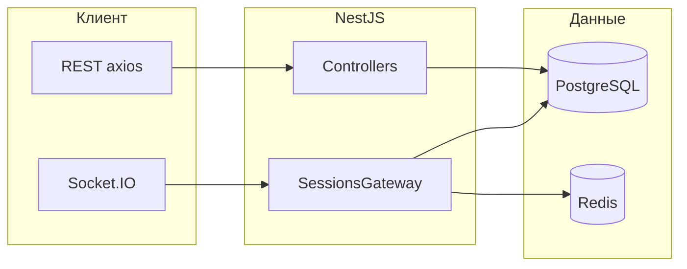

# Платформа учебных игр (Quiz Game Platform)

Веб-приложение для создания игр по шаблонам, проведения игровых сессий в классе и обмена играми через общую библиотеку. Поддерживаются регистрация и вход, публикация игр, приглашение участников по коду сессии (для викторины), обновление состояния в реальном времени через WebSocket.

Краткая схема модулей и путей в репозитории приведена в файле [arcitecture.txt](arcitecture.txt).

## Содержание

- [Технологии](#технологии)
- [Структура репозитория](#структура-репозитория)
- [Концепция и типы игр](#концепция-и-типы-игр)
- [Личная и общая библиотека](#личная-и-общая-библиотека)
- [Жалобы и администрирование](#жалобы-и-администрирование)
- [Профиль, аватар и идентификаторы](#профиль-аватар-и-идентификаторы)
- [Сохранение результатов сессии](#сохранение-результатов-сессии)
- [Установка и запуск](#установка-и-запуск)
- [Переменные окружения](#переменные-окружения)
- [Основные npm-зависимости](#основные-npm-зависимости)

## Технологии

| Часть проекта | Стек |
|---------------|------|
| Backend | NestJS, TypeORM, PostgreSQL, Socket.IO, Redis (таймеры викторины), JWT, Passport |
| Frontend | React 19, TypeScript, Vite, Redux Toolkit, React Router, axios, socket.io-client, React Flow (конструктор «Станции») |

## Структура репозитория

```
diplom/
├── backend/          # API и WebSocket-сервер (NestJS)
├── frontend/       # клиент (React + Vite)
├── arcitecture.txt # текстовая схема архитектуры
├── package.json    # минимальные корневые зависимости; основные — в backend/ и frontend/
└── README.md
```

### Backend (`backend/src`)

- `main.ts` — точка входа: глобальный префикс маршрутов `api`, порт по умолчанию `3001`, CORS для `http://localhost:5173`, раздача загрузок по префиксу `/uploads/`.
- `app.module.ts` — подключение модулей: `Auth`, `Users`, `Games`, `Sessions`, `Library`, `Reports`, `Admin`, `Redis`.
- `config/` — в том числе настройки БД и JWT.
- `common/` — guards (JWT, WebSocket), декораторы текущего пользователя, фильтры и интерцепторы.
- `redis/` — клиент Redis и настройка уведомлений для TTL-таймеров.
- `modules/auth/` — регистрация, вход, JWT-стратегия.
- `modules/users/` — пользователи, профиль, роли, блокировки.
- `modules/games/` — сущности игр, категории, вопросы, CRUD и публикация.
- `modules/sessions/` — сессии, REST, `sessions.gateway.ts` (Socket.IO), таймеры викторины (`sessions-timer.service.ts`, `sessions-timer.listener.ts`).
- `modules/library/` — поиск и выдача опубликованных игр для общей библиотеки.
- `modules/reports/` — создание жалоб на игры.
- `modules/admin/` — панель администратора: блокировки, разбор жалоб, назначение админов (для супер-админа).

### Frontend (`frontend/src`)

- `app/App.tsx`, `app/router/AppRouter.tsx` — корень приложения и маршруты.
- `app/store/` — Redux store (в т.ч. срез авторизации).
- `pages/` — экраны: создание игры, мои игры, библиотека, список сессий, конструктор шаблона, страница игры, настройки, админ-панель.
- `features/` — API и типы: `auth`, `games`, `sessions`, `templates`, `reports`, `admin`.
- `widgets/` — карточки игр и сессий, меню и др.
- `shared/` — axios-инстанс, конфиг, UI-компоненты, утилиты.

Адрес API и WebSocket по умолчанию задаются в `frontend/src/shared/config/index.ts` (`http://localhost:3001/api`, WebSocket `ws://localhost:3001`).

### Взаимодействие компонентов



## Концепция и типы игр

Тип игры задаётся в сущности игры (`backend/src/modules/games/entities/game.entity.ts`): `own`, `quiz`, `crocodile`, `wheel`, `station`.

### Однопользовательский режим (экран в аудитории)

Игра ведётся с **одного экрана** (обычно экран преподавателя): участники не подключаются к сессии по коду как отдельные клиенты викторины. К таким относятся **своя игра**, **крокодил**, **колесо фортуны**, **станции**.

### Многопользовательский режим (код сессии)

В текущей реализации флаг мультиплеера для сессии выставляется для типа **викторина** (`quiz`): команды и игроки **присоединяются по коду приглашения**, ход синхронизируется через WebSocket; таймеры вопросов опираются на Redis (см. `backend/src/modules/sessions/sessions.service.ts`).

### Описание шаблонов

| Тип | Название | Режим | Описание |
|-----|----------|--------|----------|
| `own` | Своя игра | Однопользовательский экран | Темы-категории и вопросы с очками (формат в духе классической телеигры): ведущий открывает вопросы с доски по очереди. |
| `quiz` | Викторина | Многопользовательский, **синхронный** | Вопросы с вариантами ответов и очками; участники в командах, подключение по коду сессии; ограничение по времени на вопрос. |
| `crocodile` | Крокодил | Однопользовательский экран | При создании задаётся набор терминов; в начале сессии термины **перемешиваются** и показываются в случайном порядке. Один ученик стоит у доски **спиной** к классу, остальные объясняют слово на экране **без однокоренных слов и без самого слова**; отгадывающий должен назвать термин за отведённое время (настройка `timePerTerm` в параметрах игры). |
| `wheel` | Колесо фортуны | Однопользовательский экран | Задаются **темы (секции)** и списки **вопросов** в каждой секции. При **верном** ответе вопрос исключается из очереди; при **неверном** остаётся и может выпасть снова. Если в секции не осталось вопросов, секция убирается. Сессия завершается, когда не осталось вопросов ни в одной секции. Интерфейс: `frontend/src/pages/game/WheelGamePage.tsx`. |
| `station` | Станции | Однопользовательский сценарий | Ученики **последовательно** проходят станции и выполняют задания. Если задание не выполнено, после прохождения всех станций можно **снова пройти** невыполненные (и другие невыполненные) задания. В конструкторе для каждой станции задаются **цвет**, **фигура** и **текст задания** (`StationTemplate` в `frontend/src/features/templates/types/template.types.ts`). Игровой экран: `frontend/src/pages/game/StationGamePage.tsx`. |

## Личная и общая библиотека

- **Личная библиотека («Мои игры»)** — список всех игр **текущего автора**: черновики и опубликованные. Страница: `frontend/src/pages/my-games/MyGamesPage.tsx`. Список загружается через `GET /api/games` (см. `backend/src/modules/games/games.controller.ts`).
- **Общая библиотека** — игры со статусом **опубликовано** (`published`), не помеченные как заблокированные (`isBlocked = false`). Поиск и пагинация: `backend/src/modules/library/library.service.ts`; интерфейс: `frontend/src/pages/library/LibraryPage.tsx`.

Публикация игры в общую библиотеку выполняется из «Моих игр» (модальное окно с заголовком и описанием для публичной карточки), запрос `POST /api/games/:id/publish`.

## Жалобы и администрирование

- В **общей библиотеке** авторизованный пользователь может **пожаловаться** на игру: указывается причина. Жалоба сохраняется и доступна администраторам (`frontend/src/pages/library/LibraryPage.tsx`, API `reports`, `backend/src/modules/reports/`).
- **Администратор** через панель `frontend/src/pages/admin/AdminPanelPage.tsx` просматривает жалобы, может **одобрить** или **отклонить** жалобу. При **одобрении** игра **блокируется** и перестаёт отображаться в выдаче общей библиотеки (`backend/src/modules/admin/admin.service.ts`, метод `approveReport`).
- Администратор может **блокировать пользователей** и **игры** вручную (вкладки блокировок в той же панели).
- **Супер-администратор** (роль `super_admin`) может **назначать и снимать** обычных администраторов (вкладка доступна только ему). Вход супер-администратора в системе отдельно связан с учётной записью, найденной по специальному правилу логина `admin` (см. `backend/src/modules/auth/auth.service.ts` и валидацию в `backend/src/modules/auth/dto/login.dto.ts`); пароль задаётся при создании пользователя в БД и в документации не хранится.

## Профиль, аватар и идентификаторы

- Страница **«Настройки»** (`frontend/src/pages/settings/SettingsPage.tsx`): смена **имени**, просмотр **идентификатора пользователя**, загрузка **фото профиля** или выбор **аватара** из предустановленного набора (внешние SVG-пресеты).
- **Числовой публичный идентификатор** пользователя и аналогичный идентификатор игры используются для **быстрого поиска** в общей библиотеке (ввод только цифр в строке поиска обрабатывается в `library.service.ts`), чтобы отличать игры с одинаковыми названиями и находить материалы конкретного автора.

## Сохранение результатов сессии

На экране игры (`frontend/src/pages/game/GamePage.tsx`) для **завершённой** сессии доступна кнопка **экспорта результатов в текстовый файл** (скачивание через объект `Blob`). Её можно использовать сразу после игры или **позже**, открыв ту же завершённую сессию из списка сессий.

## Установка и запуск

### Что нужно установить на машину

1. **Node.js** (рекомендуется актуальный LTS, совместимый с TypeScript 5.9 и зависимостями проекта).
2. **PostgreSQL** — созданная база данных (имя по умолчанию в коде: `quiz_game`).
3. **Redis** — для таймеров викторины и подписки на истечение ключей.

### Клонирование и открытие проекта

```bash
git clone <URL-репозитория>
cd diplom
```

Откройте папку `diplom` в редакторе (например, Cursor или VS Code). Рабочие команды выполняются из подпапок `backend` и `frontend`.

### Backend

```bash
cd backend
npm install
npm run start:dev
```

Сервер слушает порт **3001**, HTTP API доступно по префиксу **`/api`**. Для production: `npm run build` и `npm start` (запуск скомпилированного `dist/main.js`).

### Frontend

```bash
cd frontend
npm install
npm run dev
```

Клиент Vite по умолчанию: **http://localhost:5173**. В браузере откройте этот адрес и войдите или зарегистрируйтесь.

Одновременно должны быть запущены PostgreSQL, Redis и оба процесса (backend и frontend).

### Если меняются хост или порт фронтенда

- Обновите `origin` в `backend/src/main.ts` (CORS).
- Обновите `apiUrl` / `wsUrl` в `frontend/src/shared/config/index.ts`.

## Переменные окружения

Задайте переменные для процесса backend (файл `.env` в каталоге `backend` или окружение ОС).

### PostgreSQL (`backend/src/config/database.config.ts`)

| Переменная | Назначение | Значение по умолчанию |
|------------|------------|------------------------|
| `DB_HOST` | хост СУБД | `localhost` |
| `DB_PORT` | порт | `5432` |
| `DB_USERNAME` | пользователь | `postgres` |
| `DB_PASSWORD` | пароль | `postgres` |
| `DB_DATABASE` | имя базы | `quiz_game` |

В режиме разработки включена синхронизация схемы TypeORM (`synchronize: true`); для production рекомендуется отключить и использовать миграции.

### Redis (`backend/src/redis/redis.module.ts`)

| Переменная | Назначение | По умолчанию |
|------------|------------|---------------|
| `REDIS_HOST` | хост | `localhost` |
| `REDIS_PORT` | порт | `6379` |
| `REDIS_PASSWORD` | пароль, если задан | не задан |
| `REDIS_DB` | номер БД Redis | `0` |

Для корректной работы таймеров викторины приложение настраивает `notify-keyspace-events` для событий истечения ключей; при ошибке настройки в лог пишется предупреждение.

### JWT (`backend/src/config/jwt.config.ts`)

| Переменная | Назначение | По умолчанию |
|------------|------------|---------------|
| `JWT_SECRET` | секрет подписи токенов | `your-secret-key` (смените в production) |
| `JWT_EXPIRATION` | срок жизни токена | `7d` |

### Прочее

| Переменная | Назначение | По умолчанию |
|------------|------------|---------------|
| `PORT` | порт HTTP-сервера backend | `3001` |
| `NODE_ENV` | режим (влияет на логирование SQL в TypeORM) | не задан |

## Основные npm-зависимости

### Backend (`backend/package.json`)

- **@nestjs/*** — каркас приложения, HTTP, WebSocket (Socket.IO), конфиг, JWT, интеграция с TypeORM.
- **typeorm**, **pg** — ORM и драйвер PostgreSQL.
- **passport**, **passport-jwt**, **passport-local**, **bcryptjs** — аутентификация и хэш паролей.
- **class-validator**, **class-transformer** — валидация DTO.
- **socket.io** (через платформу Nest) — real-time для сессий.
- **ioredis** — клиент Redis для таймеров и слушателя истечений.
- **multer** — загрузка файлов (в т.ч. аватары).
- **dotenv** — загрузка переменных окружения.

### Frontend (`frontend/package.json`)

- **react**, **react-dom** — UI.
- **react-router-dom** — маршрутизация.
- **@reduxjs/toolkit**, **react-redux** — состояние (авторизация и др.).
- **axios** — запросы к REST API.
- **socket.io-client** — подключение к игровому gateway.
- **reactflow** — визуальный конструктор графа станций.
- **react-icons** — иконки интерфейса.

### Корень репозитория

Корневой `package.json` содержит минимальный набор; полная установка зависимостей выполняется отдельно в `backend` и `frontend`, как указано выше.
